# Active Directory & Group Policy Lab — Windows Server on Azure

A hands-on lab: building an **Active Directory** domain from scratch on **Windows Server 2022** in **Microsoft Azure**, joining a Windows client, provisioning users with **PowerShell**, and enforcing security settings through **Group Policy**.

This project demonstrates core help desk / systems administration skills: domain services, DNS, user and organizational-unit management, scripted bulk provisioning, and Group Policy configuration.

---

## Stack

| Layer | Technology |
|-------|-----------|
| Cloud | Microsoft Azure (2 VMs, same virtual network) |
| Domain Controller | Windows Server 2022 — AD DS + DNS |
| Client | Windows 10 (domain-joined) |
| Automation | PowerShell (bulk user creation) |
| Policy | Group Policy (password, lockout, remote access) |
| Domain | `corp.lab` |

---

## Architecture

```
        Azure Virtual Network
   ┌───────────────────────────────┐
   │  DC-01 (Windows Server 2022)  │   ← AD DS + DNS, static private IP
   │        Domain: corp.lab       │
   └───────────────┬───────────────┘
                   │  (client DNS points here)
   ┌───────────────┴───────────────┐
   │  CLIENT-01 (Windows 10)       │   ← domain-joined member
   └───────────────────────────────┘
```

---

## Build Steps

### 1. Install Active Directory Domain Services
Added the **AD DS** role (with Group Policy Management and administration tools) to the Windows Server 2022 VM.

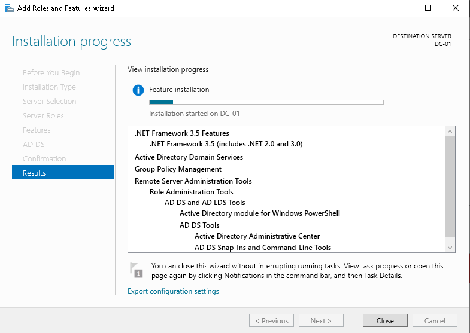

### 2. Promote the server to a Domain Controller
Promoted DC-01 to a domain controller, creating a new forest with the root domain **corp.lab**. The server now hosts AD DS and DNS.

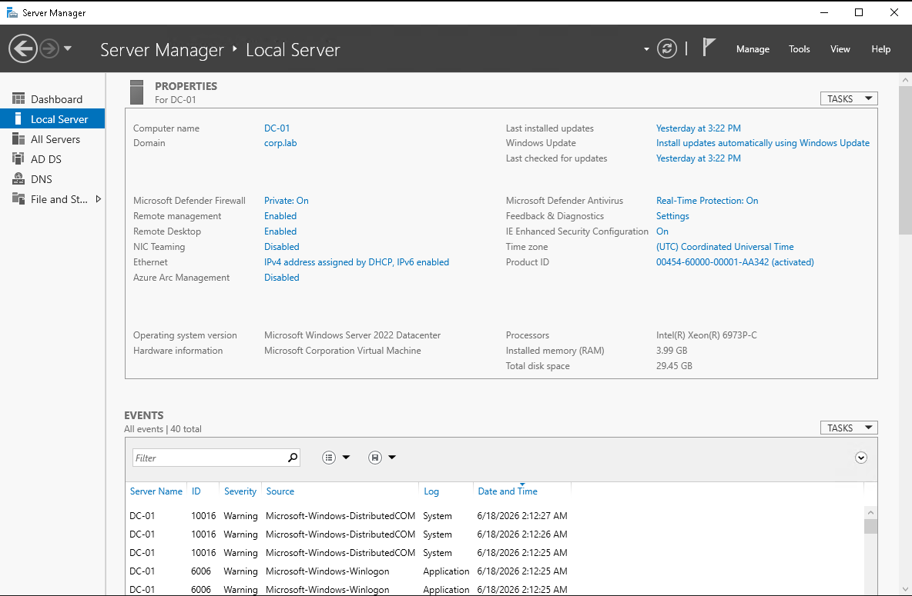

### 3. Point the client's DNS at the Domain Controller
Set the client's DNS to the DC's private IP (done in Azure), then refreshed the client's network configuration so it could locate the domain.

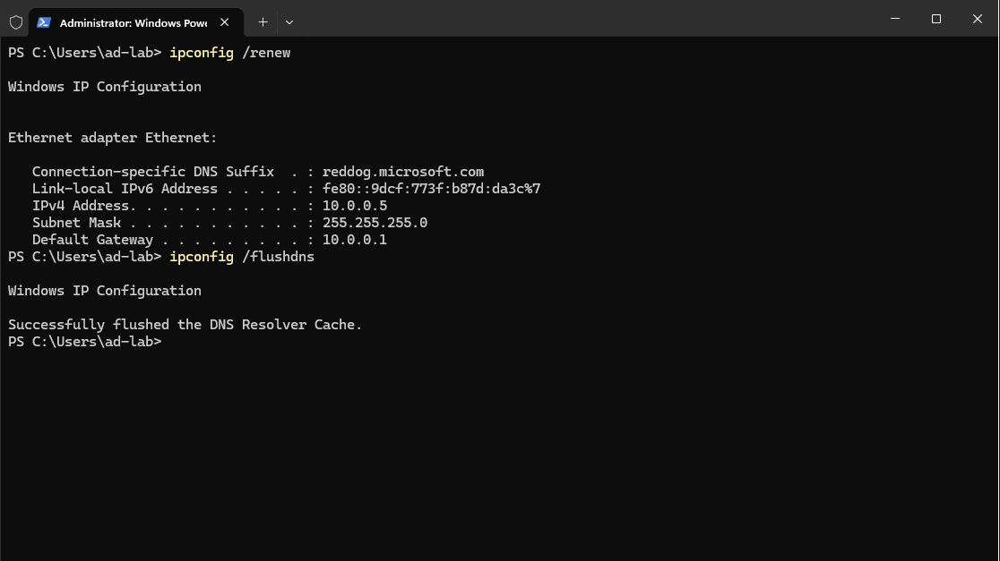

### 4. Join the client to the domain
Joined the Windows 10 client (CLIENT-01) to `corp.lab`. Confirmed in Active Directory Users and Computers that the client registered in the domain's Computers container.

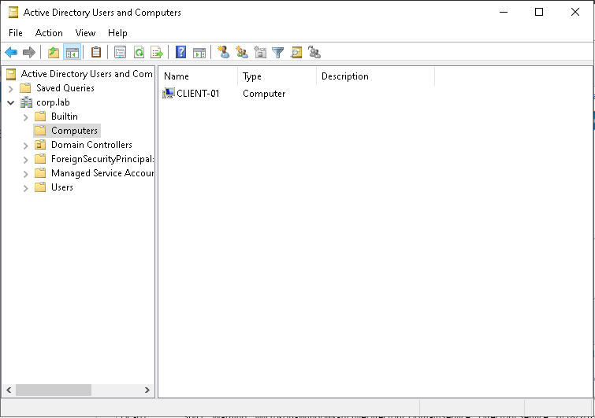

### 5. Create the Organizational Unit (OU) structure
Created departmental OUs — **Finance, Sales, IT, HR** — to organize users and apply policy by department.

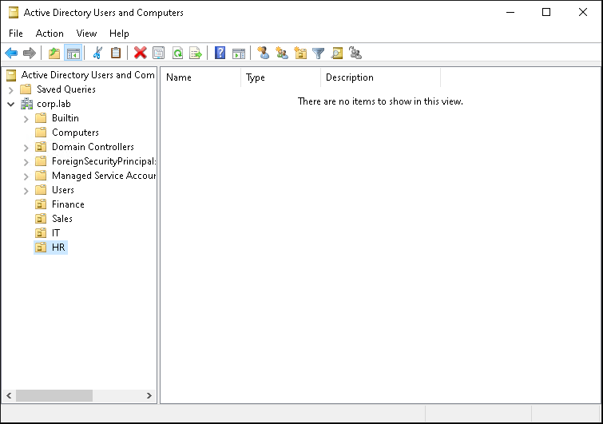

### 6. Bulk-provision users with PowerShell
Wrote and ran a PowerShell script (`Bulk-Create-Users.ps1`) to create users across the departmental OUs. The script is data-driven, idempotent (safe to re-run — it skips users that already exist), and includes error handling with color-coded output.

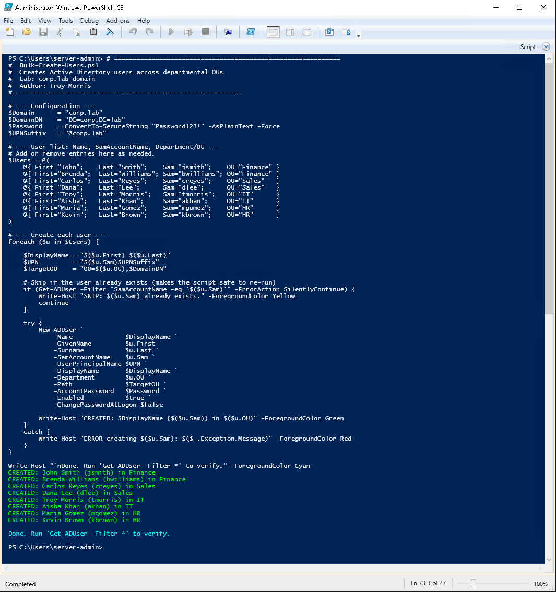

### 7. Enforce a Password Policy (Group Policy)
Created and linked a **Password Policy** GPO at the domain level:
- Minimum password length: 10 characters
- Password complexity: Enabled
- Maximum password age: 90 days
- Minimum password age: 1 day
- Enforce password history: 3 passwords remembered

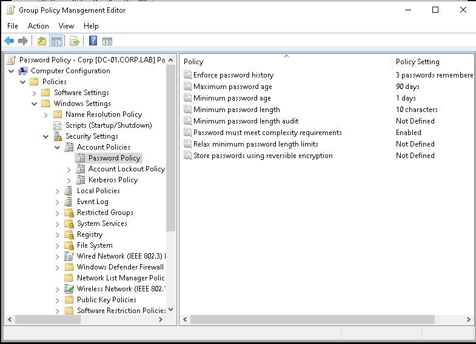

### 8. Enforce an Account Lockout Policy
Configured account lockout in the same policy to defend against brute-force attempts:
- Account lockout threshold: 5 invalid attempts
- Account lockout duration: 30 minutes
- Reset lockout counter after: 30 minutes

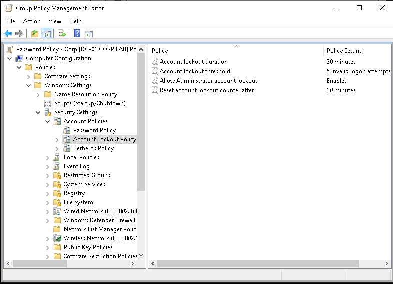

### 9. Grant Remote Desktop access via Group Policy
Created an **Allow RDP** GPO using User Rights Assignment — *Allow log on through Remote Desktop Services* — granting access to **Domain Users** and **Administrators** so domain accounts can remotely log into the client. (Administrators were included deliberately to avoid locking out admin access.)

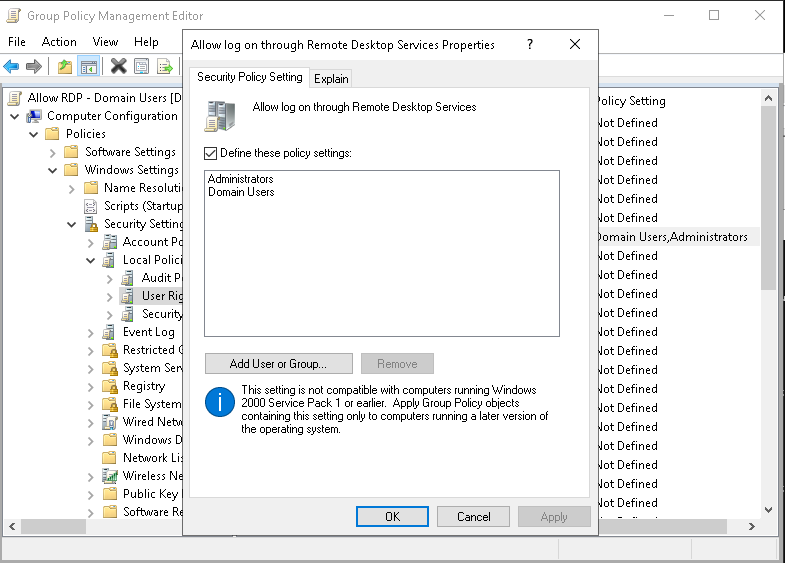

### 10. Add users to Remote Desktop Users via Restricted Groups
Granting the logon *right* alone was not enough — a domain user also needs **membership in the local Remote Desktop Users group** to establish an RDP session. Rather than adding this manually on each machine, I used **Restricted Groups** to make **Domain Users** a member of **Remote Desktop Users** automatically on any targeted computer.

To avoid overwriting existing group membership, Domain Users was added as the group with a *"This group is a member of → Remote Desktop Users"* relationship (the additive, non-destructive approach).

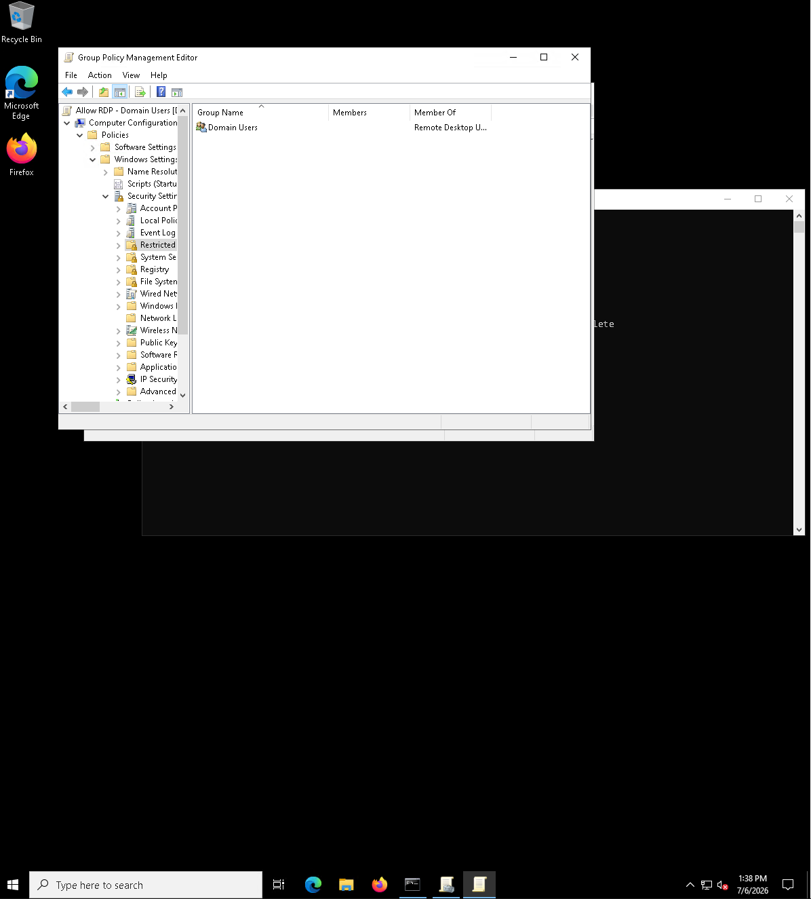

---

## Enforcement Testing

Policy configuration is only half the job — the settings were verified from the client side.

- Confirmed all three GPOs (Default Domain Policy, Password Policy - Corp, Allow RDP - Domain Users) applied to the client using `gpresult /r`.
- After running `gpupdate /force`, confirmed the Restricted Groups policy automatically placed **Domain Users** into the local **Remote Desktop Users** group.
- **Successfully logged into CLIENT-01 as a domain user (`jsmith`) over RDP** — proving the full access chain works end to end: valid domain account, logon right granted by GPO, and group membership delivered by Restricted Groups.

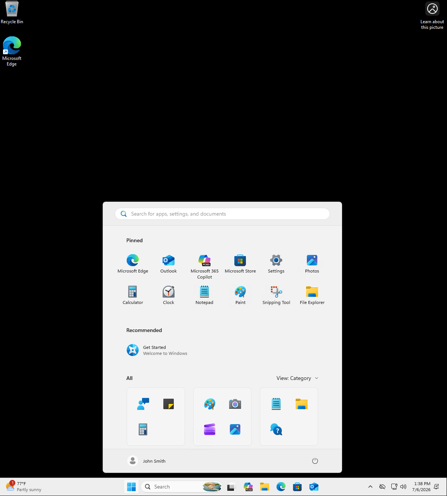

---

## Key Skills Demonstrated

- Standing up Active Directory Domain Services and DNS on Windows Server
- Creating a forest/domain and joining client machines
- Organizational Unit design for department-based management
- **PowerShell automation** for bulk user provisioning (idempotent, error-handled)
- **Group Policy** configuration: password policy, account lockout, user rights assignment, and Restricted Groups
- **Verifying enforcement** from the client side with `gpresult` and `gpupdate`, and troubleshooting a real access issue (logon right vs. group membership)
- Understanding of DNS's role in domain membership and authentication

---

## PowerShell Script

The bulk user creation script (`Bulk-Create-Users.ps1`) is included in this repository. It defines users as a data array and creates each one in the correct OU, skipping any that already exist.

---

## Troubleshooting Highlight

**Symptom:** A domain user (`jsmith`) could not RDP into the client, even after the "Allow log on through Remote Desktop Services" GPO showed as applied in `gpresult`.

**Cause:** RDP access requires *two* things — the logon **right** (User Rights Assignment) **and** membership in the local **Remote Desktop Users** group. The GPO granted the right but not the group membership.

**Fix:** Added a **Restricted Groups** policy to place Domain Users into Remote Desktop Users automatically, then verified the domain-user login succeeded. This makes RDP access fully policy-driven and scalable to any number of machines.

---

## Notes & Next Steps

- Password and lockout policies apply at the domain level; user-rights and other settings can be scoped to specific OUs.
- Group Policy changes apply on a refresh cycle; `gpupdate /force` pulls them immediately for testing.
- **Planned additions:** a drive-mapping GPO targeted by OU, and a screenshot demonstrating a weak password being rejected by the password policy.

---

*Lab project for IT support / systems administration skill development.*
